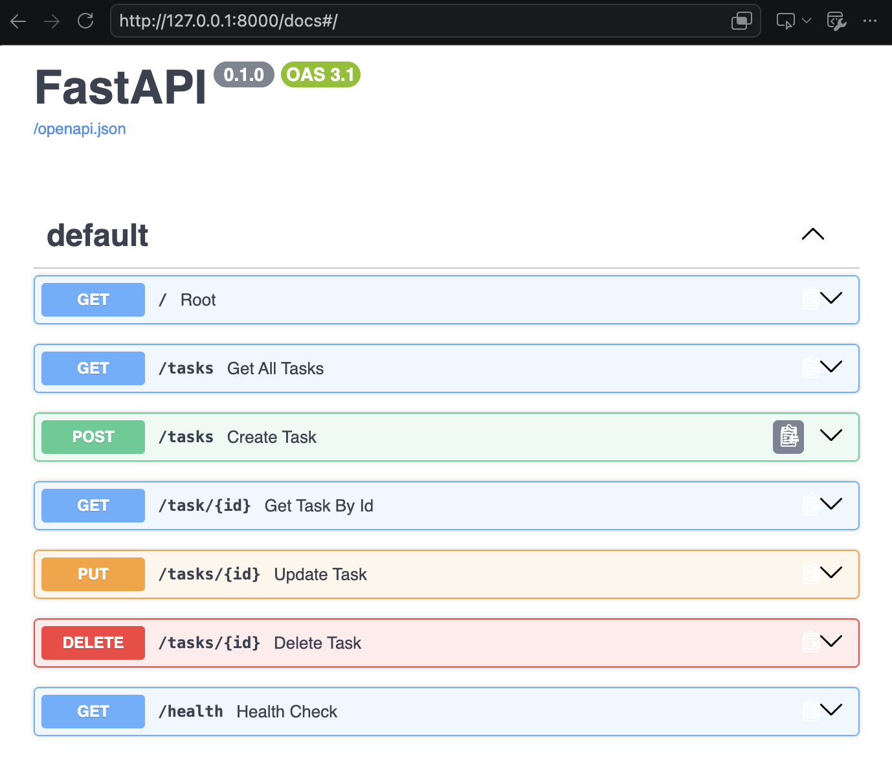

# Task API

Simple Task API built with FastAPI for Assignment 1.

What this is
- A minimal in-memory CRUD API for tasks. Tasks are stored in a list in `hello.py` (no database).

Quick install & run (single command)

Run this from the project root:

```bash
python3 -m pip install -r requirements.txt && uvicorn hello:app --reload --host 127.0.0.1 --port 8000
```
Swagger screenshot

Below is the Swagger UI screenshot included in this repository (file: `swagger.png`).



Open the live docs at `http://127.0.0.1:8000/docs` to interact with the API.

Endpoints

- GET `/` — service info
- GET `/tasks` — list all tasks
- GET `/task/{id}` — get task by id (integer)
- POST `/tasks` — create task, body: `{ "title": "Buy milk" }` → returns created task (201)
- PUT `/tasks/{id}` — update task title and/or done, body: `{ "title": "New", "done": true }` → returns updated task (200)
- DELETE `/tasks/{id}` — remove task (204 No Content)
- GET `/health` — health check

Example `curl -i` (creating a task)

```
$ curl -i -H "Content-Type: application/json" -d '{"title":"Buy milk"}' http://127.0.0.1:8000/tasks
HTTP/1.1 201 Created
date: Tue, 01 Sep 2026 12:00:00 GMT
content-type: application/json
content-length: 45

{"id":4,"title":"Buy milk","done":false}
```

Notes on the `curl` output above
- The exact `id` and headers will vary depending on what is already in `tasks` and your environment.

Resources

- Quick Git: `git init`, `git add .`, `git commit -m "initial"`, `git branch -M main`, `git remote add origin <url>`, `git push -u origin main`


